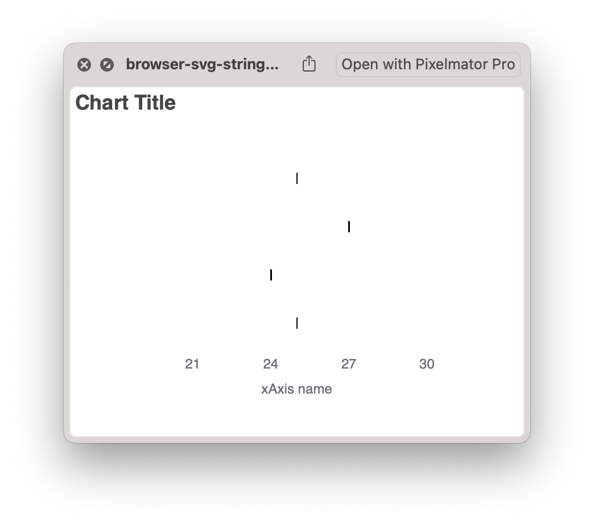

# echart.renderToSVGString() bug

## [Minimal reproducible example](src/main.ts)

## Original SVGs:

### SVG DOM:

### renderToSVGString output:

## Rasterized versions:

### SVG DOM:

### renderToSVGString output:

